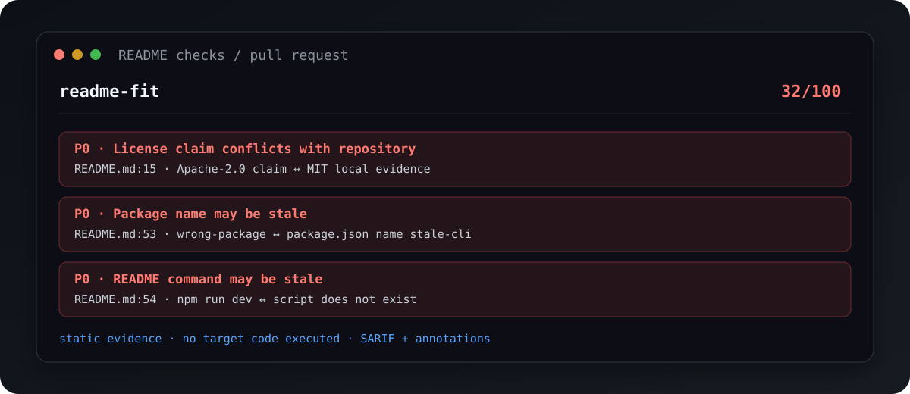

# readme-fit

[](https://github.com/XUanhoa04/readme-fit/actions/workflows/ci.yml)
[](https://www.npmjs.com/package/readme-fit)
[](LICENSE)

**Catch README drift before users copy a broken command.**

`readme-fit` connects claims in a README to evidence in the repository, explains contradictions,
and emits findings that can block a pull request. It is a static analyzer—not a README generator.

```text
README claim → repository evidence → verification → actionable finding
```

```bash
npx readme-fit scan .
```

```text
readme-fit 32/100
P0 License claim conflicts with repository (README.md:15)
P0 Package name may be stale (README.md:53)
P0 README command may be stale (README.md:54)
```



## Why readme-fit

A polished README can still be wrong. A valid Markdown document can still tell users to install the
wrong package, run a deleted script, follow a broken path, or trust a screenshot that proves
nothing. Those are repository-evidence problems.

| Capability                                 | Markdown linter | Link checker | README generator | readme-fit |
| ------------------------------------------ | --------------- | ------------ | ---------------- | ---------- |
| Markdown structure                         | Yes             | No           | Template         | Yes        |
| Commands vs package scripts                | No              | No           | No               | Yes        |
| Package/runtime/license claim drift        | No              | No           | No               | Yes        |
| Workspace-aware project classification     | No              | No           | No               | Yes        |
| First-success and visible-proof heuristics | No              | No           | Template         | Yes        |
| Baseline, SARIF, and PR annotations        | Sometimes       | Sometimes    | No               | Yes        |
| Runs target project code                   | Varies          | No           | Varies           | Never      |

The deterministic engine owns facts. Heuristics are labeled as heuristics, and missing evidence
reduces coverage instead of becoming an implicit pass.

## Quick start

Node.js 20 or newer is required.

```bash
# Scan the current repository
npx readme-fit scan

# Explain every rule result
npx readme-fit scan --verbose

# Machine-readable output
npx readme-fit scan --format json

# Validate configuration and environment
npx readme-fit doctor
```

Exit code `0` means the scan completed without a configured gate failure, `1` means a quality gate
failed, and `2` means the input, configuration, or analysis was invalid.

## Pull-request gate

Use the dedicated action after checkout:

```yaml
- uses: XUanhoa04/readme-fit@v1
  with:
    fail-on: high
    fail-on-score: 80
    changed-since: ${{ github.event.pull_request.base.sha }}
```

Or use the CLI directly:

```bash
npx readme-fit scan --format github --fail-on high
npx readme-fit scan --format sarif --output readme-fit.sarif
```

`--changed-since` attaches findings only to changed files. Existing backlogs can use a stable
baseline instead:

```bash
npx readme-fit baseline --output .readme-fit-baseline.json
npx readme-fit scan --baseline .readme-fit-baseline.json --fail-on high
```

See [CI integration](docs/ci.md) for permissions, SARIF upload, and rollout strategies.

## What it verifies

| README claim or surface | Repository evidence                                     | Result type          |
| ----------------------- | ------------------------------------------------------- | -------------------- |
| package script command  | `package.json` scripts                                  | deterministic        |
| install/package target  | npm or Python project metadata                          | deterministic        |
| relative link or anchor | canonical repository path and Markdown headings         | deterministic        |
| runtime requirement     | engines, version files, and `pyproject.toml`            | deterministic        |
| license claim           | SPDX metadata and recognizable local license text       | deterministic        |
| external URL            | bounded public HTTP response, only with `--check-links` | opt-in               |
| first-success path      | headings, commands, examples, and placement             | documented heuristic |
| visible product proof   | representative output, screenshot, GIF, or recording    | documented heuristic |

The claim/evidence graph is included in JSON. A static match does not claim that a command was
executed successfully.

## Project-aware rubrics

Stable v1 completeness rubrics cover:

- CLI;
- library and SDK;
- web application;
- API;
- desktop application;
- GitHub Action.

The classifier also recognizes mobile apps, editor extensions, AI projects, datasets,
infrastructure, tutorials, templates, and documentation repositories. These labels remain
experimental until their fixture corpora are calibrated. Reports expose `rubricStatus` so CI never
confuses recognition with stable scoring support.

Node, Python, Rust, and Go manifests are discovered across npm/pnpm workspaces, uv workspaces,
Cargo workspaces, and `go.work`. Select a nested project explicitly when needed:

```bash
npx readme-fit scan . --project packages/cli --readme README.md
```

## Scoring without score theater

Rules return `pass`, `partial`, `fail`, or `not_applicable`. Category scores are normalized from
visible rule results. Overall is a weighted score across covered categories, and
`overallCoverage` reports how much of the configured rubric contributed.

Every deduction has a rule result. Every actionable partial or failure has a finding. Optional,
skipped, unsupported, and absent-evidence checks cannot increase the score.

The focused first-impression view asks five explicitly heuristic questions:

```bash
npx readme-fit impression
```

```text
Understand WHAT it is?    YES
Understand WHY I need it? YES
See it working?           YES
Know how to try it?       YES
Trust the project?        PARTLY
```

It is not eye tracking or user research.

## Configuration v2

Create a strict, declarative config:

```bash
npx readme-fit init
npx readme-fit config validate
```

```yaml
version: 2
extends: ./config/readme-fit.base.yml

project:
  type: auto

scoring:
  preset: oss

rules:
  correctness: true
  overrides:
    impression.proof:
      weight: 30
    trust.badges.signal-to-noise:
      enabled: false

ignore:
  paths:
    - examples/generated/**
```

Only local YAML files inside the repository can be extended; cycles, path escapes, URLs, unknown
keys, invalid weights, and unknown rule IDs fail validation. Version 1 configs are migrated in
memory for one compatibility window. See [configuration](docs/configuration.md) and the published
[JSON Schema](schemas/config.schema.json).

## CLI reference

| Command                  | Purpose                                      |
| ------------------------ | -------------------------------------------- |
| `scan [path]`            | run the complete repository audit            |
| `impression [path]`      | show only the five first-impression metrics  |
| `baseline [path]`        | capture regression fingerprints              |
| `init [path]`            | create config v2 without overwriting a file  |
| `doctor [path]`          | validate config and inspection prerequisites |
| `config validate [path]` | normalize and validate config                |
| `list-rules`             | list rule IDs and explanations               |
| `explain <rule-id>`      | explain one rule                             |
| `profile <user>`         | experimental public GitHub profile audit     |

Common scan options include `--project`, `--readme`, `--check-links`, `--changed-since`,
`--baseline`, `--fail-on`, `--fail-on-score`, `--max-findings`, `--output`, `--verbose`, `--quiet`,
and `--no-color`.

## Machine output and API

JSON, SARIF 2.1.0, and GitHub workflow-command reporters are built in. Versioned schemas live in
[`schemas/`](schemas/).

```js
import { createAnalyzer } from 'readme-fit';
import { defineRule } from 'readme-fit/rules';

const teamRule = defineRule({
  id: 'team.support.visible',
  category: 'trust',
  description: 'Checks the team support contract.',
  applies: () => true,
  evaluate: ({ readme }) => {
    const present = readme.raw.includes('## Support');
    return {
      score: {
        id: 'team.support.visible',
        status: present ? 'pass' : 'fail',
        weight: 10,
        earned: present ? 10 : 0,
        explanation: 'Team support section policy.',
      },
      findings: present
        ? []
        : [
            {
              id: 'team.support.visible',
              category: 'trust',
              severity: 'low',
              priority: 'P3',
              confidence: 'high',
              title: 'Support path is not visible',
              source: { path: readme.path },
              observation: 'No Support section was found.',
              recommendation: 'Document the maintained support channel.',
              evidence: [{ type: 'heading', message: 'Support heading not found' }],
              deterministic: true,
            },
          ],
    };
  },
});

const analyzer = createAnalyzer({ rules: [teamRule] });
const report = await analyzer.analyze('.');
```

Analyzers own isolated registries; custom packs do not mutate a global rule list. Public subpaths
are `readme-fit/rules`, `readme-fit/reporters`, and `readme-fit/config`. See
[rule authoring](docs/rule-authoring.md).

## Safety model

Repositories are untrusted input. An offline scan:

- reads bounded metadata and Markdown;
- never executes README commands, package scripts, target code, containers, or imported modules;
- keeps configured README and extended config files inside the canonical repository root;
- caps repository inspection at 10,000 files and text inputs at 1 MiB;
- never performs network requests unless `--check-links` is explicit;
- blocks loopback, private, link-local, metadata, and unsafe redirect destinations.

External checks cap links, concurrency, redirects, response time, and response size. Network and
authentication failures are `unverified`, not fabricated as success. See [SECURITY.md](SECURITY.md).

## Known limits

- Static evidence does not prove runtime success.
- Remote screenshots, video content, and prose truthfulness are not inspected.
- External links are offline by default.
- Experimental project labels do not have stable completeness rubrics.
- GitHub's public profile API does not expose pinned-repository selection.
- First-impression findings are heuristics, not behavioral measurements.

Each report repeats the limits that affected that scan. If a finding is wrong, use the
[false-positive guide](docs/false-positives.md) and include a minimal fixture in the report.

## Development

```bash
npm install
npm run typecheck
npm run lint
npm run format:check
npm test
npm run test:coverage
npm run build
npm run test:package
npm run benchmark
npm run dogfood
```

The suite includes property tests, adversarial fixtures, JSON Schema validation, package install
smoke tests, a 2,001-file benchmark, and Windows/macOS/Linux CI on Node 20 and 22.

## Project docs

- [Product contract](docs/v1-product-contract.md)
- [Architecture](docs/architecture.md)
- [Configuration](docs/configuration.md)
- [CI integration](docs/ci.md)
- [Rule authoring](docs/rule-authoring.md)
- [Migrating to v1](docs/migrating-to-v1.md)
- [Changelog](CHANGELOG.md)

Contributions are welcome. Start with [CONTRIBUTING.md](CONTRIBUTING.md), follow the
[Code of Conduct](CODE_OF_CONDUCT.md), and use private security reporting for vulnerabilities.

## License

MIT
